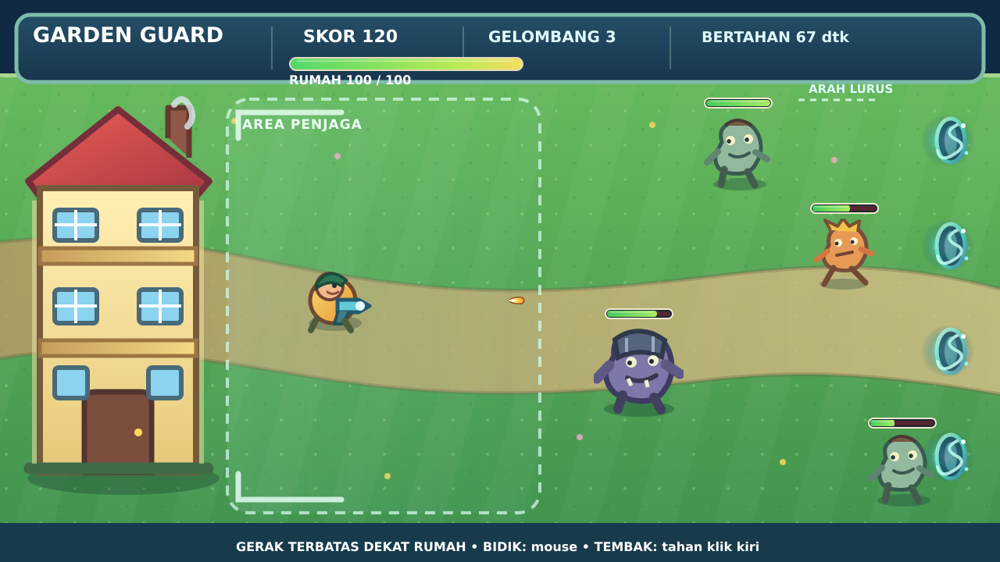

# Garden Guard

## Kontrol

- Bergerak: `W/A/S/D` atau tombol panah di dalam area penjaga dekat rumah.
- Membidik: gerakkan mouse.
- Menembak: tahan klik kiri.
- Mulai ulang setelah game over: klik **MAIN LAGI** atau tekan `R`.

## Tiga tipe musuh

| Objek        | Peluang |  HP |  Kecepatan | Damage rumah | Nilai |
| ------------ | ------: | --: | ---------: | -----------: | ----: |
| `EnemyBasic` |     55% |  50 |  70 px/dtk |            8 |    10 |
| `EnemyFast`  |     27% |  30 | 125 px/dtk |            5 |    15 |
| `EnemyTank`  |     18% | 160 |  42 px/dtk |           18 |    30 |

Ketiganya dimasukkan ke object group `Enemies`, sehingga event gerak, serangan, collision, health bar, dan kematian tidak perlu diduplikasi.

## Nyawa di atas musuh

- Setiap musuh mempunyai variabel objek `HP` dan `MaxHP`.
- Saat musuh dibuat, proyek juga membuat `EnemyHPBack` dan `EnemyHPFill`, lalu menautkan keduanya ke instance musuh tersebut dengan **Linked Objects**.
- Event `06A_ENEMY_HEALTH_BAR` membuat bar mengikuti posisi musuh dan menghitung lebarnya dengan `82 × HP / MaxHP`.
- Ketika HP musuh mencapai 0, kedua bagian bar ikut dihapus sebelum musuh dihapus.

## Mekanik pertahanan rumah

- Posisi pemain dibatasi pada `X 300–580` dan `Y 130–555` agar selalu berada di area dekat rumah.
- Batas tersebut ditampilkan oleh objek `DefenseZone` sehingga pemain memahami area yang dapat dijelajahi.
- Empat objek `SpawnPoint` berfungsi sebagai portal pada sisi kanan arena.
- Musuh bergerak lurus ke kiri dengan mengurangi posisi X berdasarkan `Speed × TimeDelta()`; posisi Y tidak diubah.
- Rumah diperbesar menjadi `270 × 520 px` dan garis serangnya berada pada `X 286`, sehingga musuh dari semua portal dapat tetap bergerak lurus.

## Susunan visual events

1. `01_INIT` — reset variabel/timer dan sembunyikan UI game over.
2. `02_INPUT_TOPDOWN` — gerak delapan arah berbasis `TimeDelta()` dengan batas area dekat rumah.
3. `03_AIM_AND_SHOOT` — rotasi ke kursor, cooldown, create Bullet, dan force permanen.
4. `04_RANDOM_SPAWN` — pilih SpawnPoint dan tipe musuh secara acak.
5. `05_ENEMY_AI` — musuh bergerak horizontal dari portal dan menyerang setelah mencapai garis rumah.
6. `06_COMBAT` — peluru mengurangi HP; musuh mati menambah skor.
7. `06A_ENEMY_HEALTH_BAR` — bar tertaut mengikuti musuh dan menampilkan sisa HP.
8. `07_TIME_AND_UI` — gelombang, kesulitan, teks HUD, dan health bar rumah.
9. `08_GAME_OVER_AND_RESTART` — membekukan permainan dan mengulang scene.

## Balancing yang mudah diubah

- Data masing-masing musuh berada pada **Object Variables**: `HP`, `MaxHP`, `Speed`, `Damage`, `AttackInterval`, dan `ScoreValue`.
- Damage peluru berada pada `Bullet.Variable(Damage)`.
- HP rumah, skor, gelombang, dan waktu berada pada **Scene Variables**.
- Bobot random tipe musuh berada pada sub-event `04_RANDOM_SPAWN`.
- Cooldown tembakan di event `03_AIM_AND_SHOOT` adalah `0.22` detik.

Seluruh aset SVG bersifat orisinal dan sengaja sederhana agar mudah diganti dengan sprite produksi.
